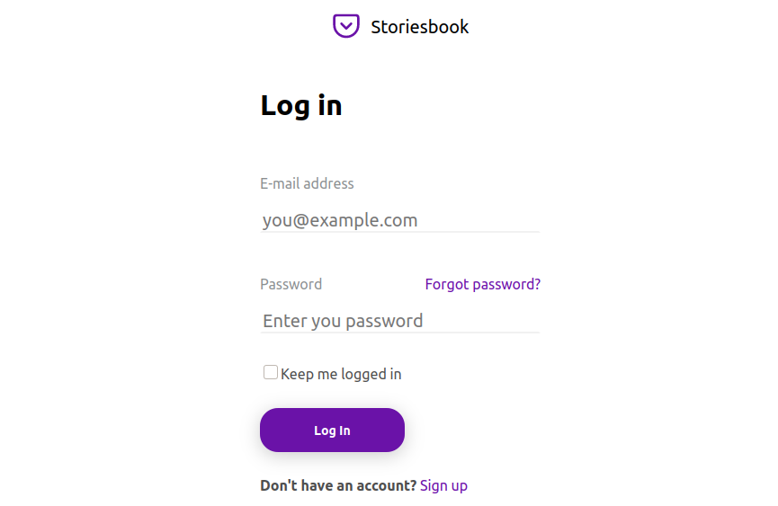

# Storiesbook

> Storiesbook on a platform that allows you to post photos that are visible for 24 hours, and can be seen by all users.

## Components

This project consists of two components, creatively named frontend and backend. The frontend is a single-page application using React.js. The backend is a API REST developed with typescript, Node.js, express and Postgres.

## Developing Frontend

To get started with developing on frontend, you'll need to install dependencies. First of all you need to have [Node.js](https://nodejs.org) installed. Run `yarn install` to install all dependencies.

`yarn dev` will start a hot-reloading webserver on `http://localhost:3000` which will automatically reflect your changes.

## Developing Backend

Again, install all Node-related dependencies with a simple `yarn install`.

> Still in development

# License

[MIT](http://opensource.org/licenses/MIT)